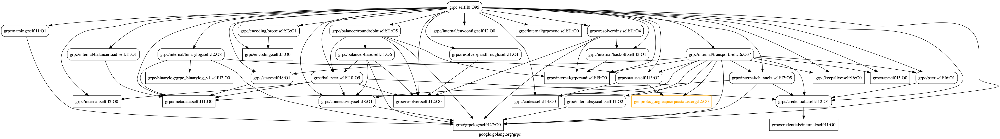
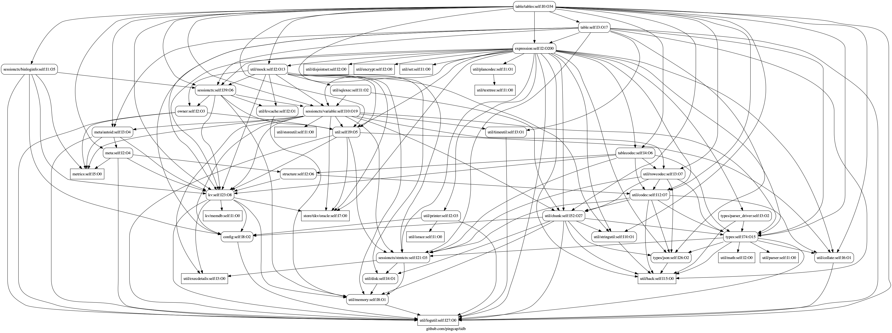

# govisual
Visualize golang project dependencies.

# installation

First install graphviz.

eg. for macos, run
```
brew instal graphviz
```

then, 
```
go install github.com/liguangsheng/govisual/...
```

# usage
```
Usage of govisual:
  -all
    	include all subdirectory
  -host-as-org
    	include all subdirectory
  -hostasorg string
    	include organization packages
  -module string
    	custom module name
  -org
    	include all subdirectory
  -sys
    	include go sdk packages
  -templates value
    	custom template files
  -third
    	include third party packages
```

# example

```
govisual <path-to-your-go-project>
```

generate png file with graphviz
```
govisual <path> | dot -Tpng -o /tmp/graph.png
```

### visual for grpc-go

```
$ govisual -host-as-org  -org | dot -Tpng -o grpc-go.png
```



### visual for pingcap/tidb/table/tables

```
$ govisual table/tables | dot -Tpng -o tidb-table-tables.png
```

